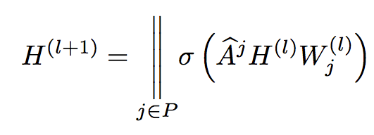

# Tensorflow Implementation of A Higher-Order Graph Convolutional Layer

### White paper
>A Higher-Order Graph Convolutional Layer. Sami A Abu-El-Haija, Bryan Perozzi, Amol Kapoor, Nazanin Alipourfard, Hrayr Harutyunyan. NeurIPS, 2018. [[link]](https://arxiv.org/abs/1809.07697)

In traditional Convolutional Neural Networks (CNNs), a series of convolutional layers calculate a location-equivarient transformation. This is done by rasterizing a learned filter across the spatial dimension. Typically, CNNs are used on images which exist on a euclidean grid. This grid allows one to generalize across the spatial dimensions.

However, data represented by a Graph exists in a non-euclidean domain. As a result, generalizing CNNs to graphs is not straightforward because convolution operators are only defined for regular grids. To define a convolution filter for a graph two approaches exist; a spatial approach or a spectral approach. While a convolution in the spatial domain is possible, it requires some way to match local neighborhoods. More troubling, is the fact that in the spatial domain their exists no definition of translation on graphs, making it impossible to adopt the rasterization technique seen in traditional CNNs. 

Luckily, the spectral approach provides a mathematical definition of a convolution operator using the Graph Laplacian. In addition it provides a well-defined localization operator on graphs by convolving with a Kronecker delta. Previous works by Defferrard et al and Kipf & Welling proposed approximation to the graph convolution that are computationally efficient but reduce the modeling capacity. To circumvent this issue, Abu-El-Haija et al proposed a new graph convolutional layer known as A Higher-Order Graph Convolutional Layer. This layer mixes powers of the adjacency matrix which allows the model to learn delta operators.

## How it works

A Higher-Order Graph Convolutional Layer is defined as follows:




Where P is a set of integers defining the powers of A, the adjacency matrix. A^j denotes the number of times A is multiplied by itself and || is a column-wise concatenation. Below is a figure from the paper which illustrates a convolution for P = {1, 2, 3}:


The Code:

```Python
def higher_order_gcl(feats, A_norm, num_filters, iterations):
    xavier_init = tf.glorot_uniform_initializer()
    weights = tf.Variable(
        xavier_init([feats.shape[1], num_filters]),
        name="weights"
    )
    bias = tf.Variable(
        tf.random_normal([num_filters]),
        name='bias'
    )
    feat_sparse_tensor = tf.SparseTensor(
        indices=np.array([feats.row, feats.col]).T,
        values=[float(f) for f in feats.data],
        dense_shape=feats.shape,
    )

    output = tf.nn.relu(
        tf.sparse.sparse_dense_matmul(feat_sparse_tensor, weights) + bias
    )

    prop_mat_tensor = tf.SparseTensor(
        indices=np.array([A_norm.row, A_norm.col]).T,
        values=[float(f) for f in A_norm.data],
        dense_shape=[output.shape[0], output.shape[0]],
    )

    for _ in range(iterations):
        output = tf.sparse.sparse_dense_matmul(
            prop_mat_tensor,
            output
        )

    return output
```

## Examples

With this implementation I included two datasets: citeseer and CORA. 


### Citeseer

The citeseer dataset contains information about publications within AI. It contains 3,327 nodes representing a feature vector for a single publication and 4,732 edges which represent citations. Each node has a label from one of 6 classes: Agents,
AI,
DB,
IR,
ML,
and
HCI.


#### Results

Using A Higher-Order Graph convolutional layer with the following hyper parameters:

```Python

    config = {
        'name': 'citeseer',
        'num_epochs': 200,
        'layers': [64, 64, 64],
        'learning_rate': 1.0e-2,
        'summary_dir': 'logs',
        'save_dir': 'snapshots',
        'h5_file': 'citeseerData.h5',
        'saver_max_to_keep': 30,
    }
```

A classification accuray of 93.2% was obtained:


### CORA

The CORA dataset is also a dataset of AI publications. It contains 2,708 nodes representing a feature vector for a publication and 5,429 edges representing citations. Nodes are labeled by 7 classes:
Case_Based,
Genetic_Algorithms,
Neural_Networks,
Probabilistic_Methods,
Reinforcement_Learning,
Rule_Learning,
and
Theory.


####  Results
Training with the same hyper-parameters as before results in a classification accuracy of 97.4%:

